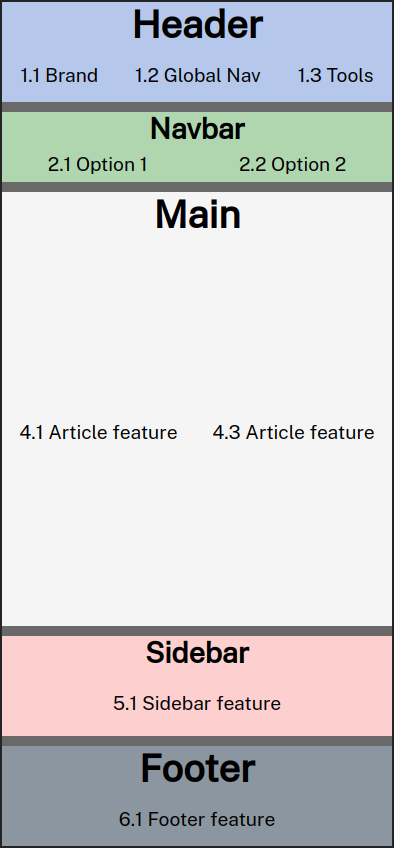
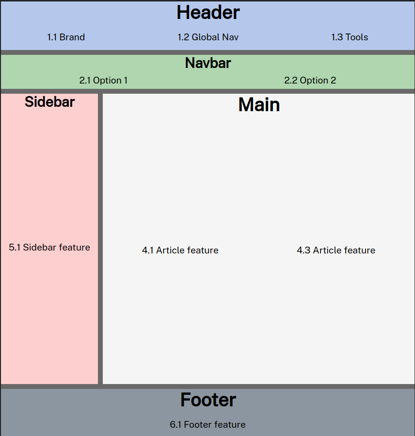
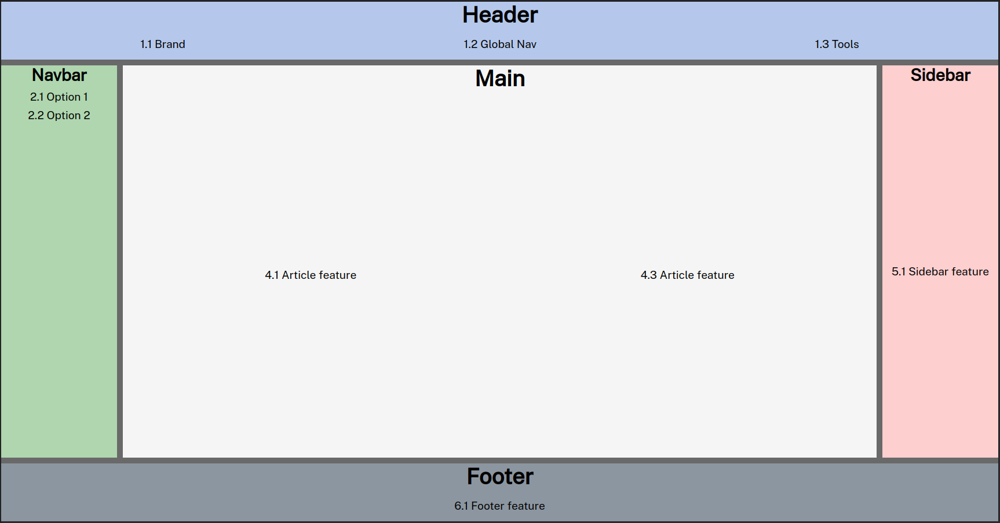

# Responsive css template design

This is a practical example of good practice using css-grid and flexbox. Use it to start the design of your project. The first mobile methodology is being used.

## Mobile

## Table

## Desktop

## References
- https://www.youtube.com/watch?v=T4t00Hd3qZc&t=32s&ab_channel=YoelvisMulen%7Bcode%7D

- https://www.initcoms.com/que-es-mobile-first-posicionamiento/

- https://github.com/ymulenll/css-grid-template

## License

[MIT](https://choosealicense.com/licenses/mit/)

